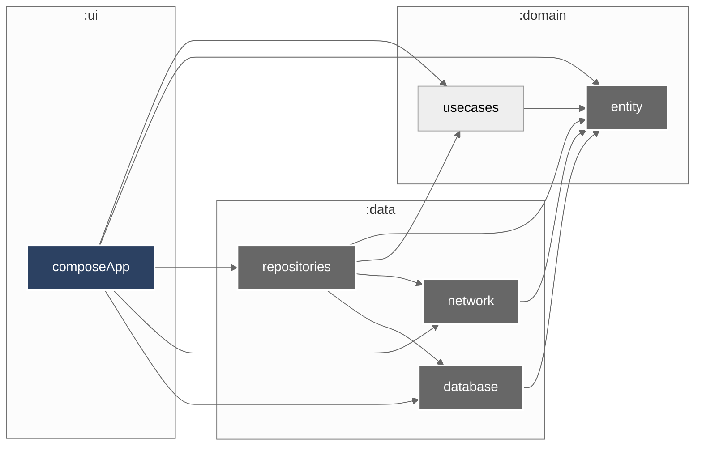

# Primary Graph - Compose 1

```mermaid
%%{
  init: {
    'theme': 'neutral'
  }
}%%

graph LR

  subgraph :ui
    :composeApp["composeApp"] 
  end
  
  subgraph :domain
    :domain:useCases["usecases"]
    :domain:entity["entity"]
  end
  
  subgraph :data
    :data:network["network"]
    :data:database["database"]
    :data:repositories["repositories"]
  end

    :domain:useCases --> :domain:entity
    :composeApp --> :domain:useCases
    :composeApp --> :domain:entity
    :composeApp --> :data:repositories
    :composeApp --> :data:network
    :composeApp --> :data:database
    :data:database --> :domain:entity
    :data:network --> :domain:entity

    :data:repositories --> :domain:entity
    :data:repositories --> :domain:useCases
    :data:repositories --> :data:network
    :data:repositories --> :data:database 

classDef android-application fill:#2C4162,stroke:#fff,stroke-width:2px,color:#fff;
classDef unknown fill:#676767,stroke:#fff,stroke-width:2px,color:#fff;
class :composeApp android-application
class :domain:entity unknown
class :data:repositories unknown
class :data:network unknown
class :data:database unknown

```