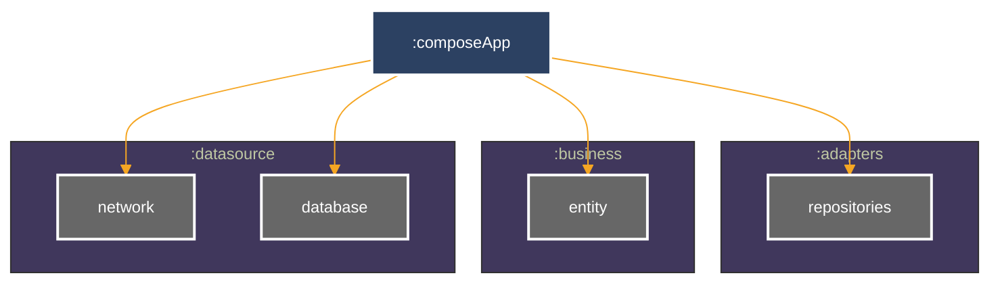
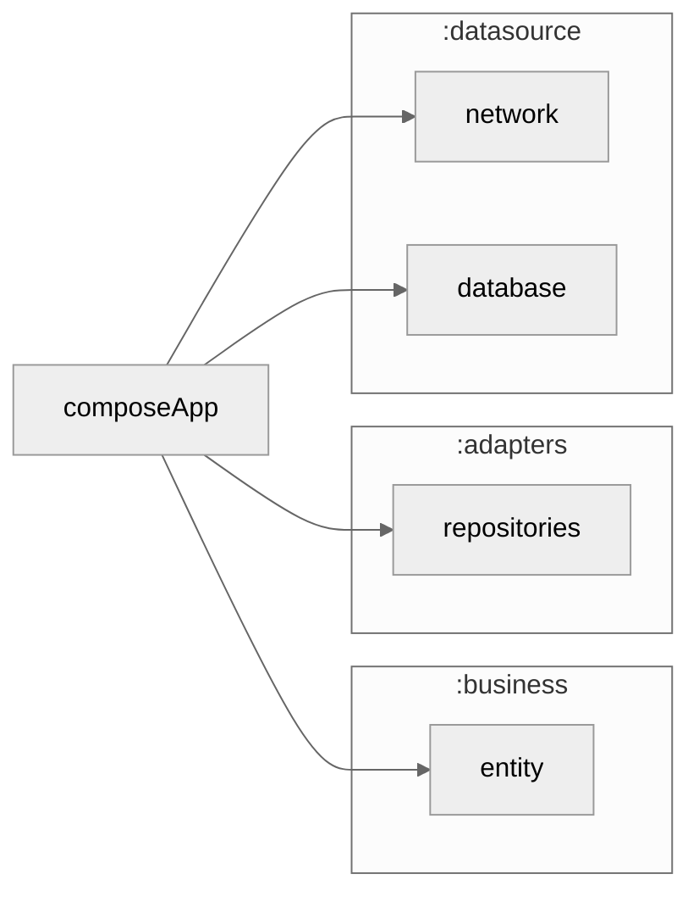

# Primary Graph

```mermaid
%%{
  init: {
    'theme': 'base',
    'themeVariables': {"primaryTextColor":"#F6F8FAff","primaryColor":"#5a4f7c","primaryBorderColor":"#5a4f7c","tertiaryColor":"#40375c","lineColor":"#f5a623","fontSize":"12px"}
  }
}%%

graph TB
  subgraph :adapters
    :adapters:repositories["repositories"]
  end
  subgraph :business
    :business:entity["entity"]
  end
  subgraph :datasource
    :datasource:network["network"]
    :datasource:database["database"]
  end
  :composeApp --> :business:entity
  :composeApp --> :adapters:repositories
  :composeApp --> :datasource:network
  :composeApp --> :datasource:database

classDef android-application fill:#2C4162,stroke:#fff,stroke-width:2px,color:#fff;
classDef unknown fill:#676767,stroke:#fff,stroke-width:2px,color:#fff;
class :composeApp android-application
class :business:entity unknown
class :adapters:repositories unknown
class :datasource:network unknown
class :datasource:database unknown

```
### Module Graph - Compose

```mermaid
%%{
  init: {
    'theme': 'neutral'
  }
}%%

graph LR
  :composeApp["composeApp"]
  subgraph :business
    :business:entity["entity"]
  end
  subgraph :adapters
    :adapters:repositories["repositories"]
  end
  subgraph :datasource
    :datasource:network["network"]
    :datasource:database["database"]
  end

  :composeApp --> :business:entity
  :composeApp --> :adapters:repositories
  :composeApp --> :datasource:network
  :composeApp --> :datasource:database
```