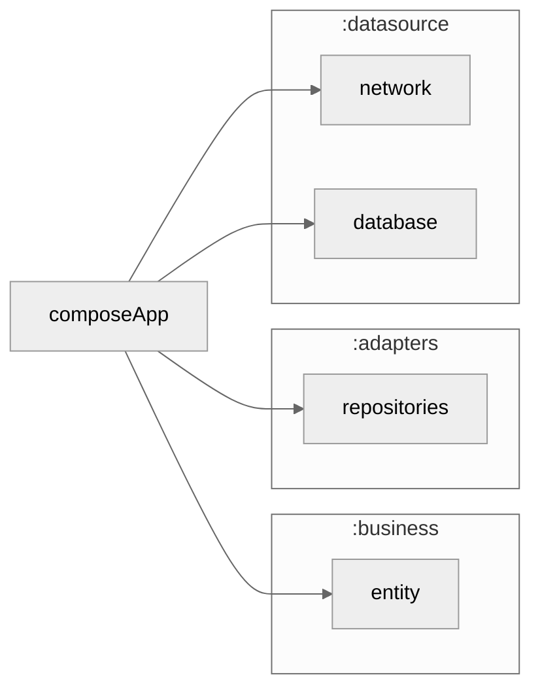

### Module Graph - Compose

```mermaid
%%{
  init: {
    'theme': 'neutral'
  }
}%%

graph LR
  :composeApp["composeApp"]
  subgraph :business
    :business:entity["entity"]
  end
  subgraph :adapters
    :adapters:repositories["repositories"]
  end
  subgraph :datasource
    :datasource:network["network"]
    :datasource:database["database"]
  end

  :composeApp --> :business:entity
  :composeApp --> :adapters:repositories
  :composeApp --> :datasource:network
  :composeApp --> :datasource:database
```