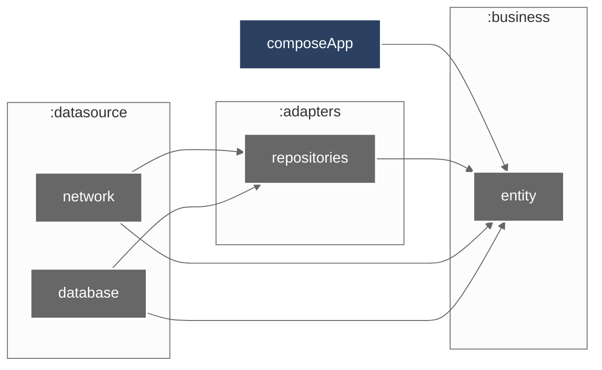

# Primary Graph - Compose 1

```mermaid
%%{
  init: {
    'theme': 'neutral'
  }
}%%

graph LR
    
  :composeApp["composeApp"]
  
  subgraph :business
    :business:entity["entity"]
  end
  
  subgraph :adapters
    :adapters:repositories["repositories"]
  end
  
  subgraph :datasource
    :datasource:network["network"]
    :datasource:database["database"]
  end

  :composeApp --> :business:entity
%%  :composeApp --> :adapters:repositories
%%  :composeApp --> :datasource:network
%%  :composeApp --> :datasource:database
  :adapters:repositories --> :business:entity
  :datasource:network --> :business:entity
  :datasource:network --> :adapters:repositories
  :datasource:database --> :business:entity
  :datasource:database --> :adapters:repositories

classDef android-application fill:#2C4162,stroke:#fff,stroke-width:2px,color:#fff;
classDef unknown fill:#676767,stroke:#fff,stroke-width:2px,color:#fff;
class :composeApp android-application
class :business:entity unknown
class :adapters:repositories unknown
class :datasource:network unknown
class :datasource:database unknown

```