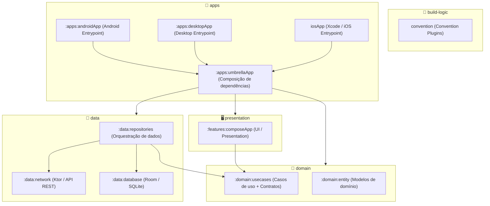

# Pokédex — Kotlin Multiplatform

Aplicativo multiplataforma (Android · iOS · Desktop) construído sobre **Kotlin Multiplatform** e **Compose Multiplatform**, usando a [PokéAPI](https://pokeapi.co) como fonte de dados.

---

## Índice

1. [Rodando o projeto](#rodando-o-projeto)
2. [Demonstração](#demonstração)
3. [Objetivo](#objetivo)
4. [Estrutura](#estrutura)
5. [Arquitetura](#arquitetura)
6. [Trade-offs da API](#trade-offs-da-api)
7. [Destaques técnicos](#destaques-técnicos)
8. [Pontos de melhoria](#pontos-de-melhoria)

---

## Rodando o projeto

O app está acessível nas **três plataformas** (Android, iOS e Desktop). **Basta usar o Android Studio**: abra o projeto, selecione na barra de execução a **configuração do alvo** que quiser rodar (por exemplo o módulo `androidApp`, o `desktopApp` ou a variante iOS) e inicie — o mesmo fluxo serve para cada plataforma.

---

## Demonstração

Gravação do app em execução: navegação entre lista e detalhe, enriquecimento progressivo dos tipos ao rolar e carregamento das informações de espécie na tela de detalhe.

**[Abrir vídeo da demonstração](https://raw.githubusercontent.com/enirsilvaferraz/Pokedex/main/docs/pokedex-demo.mov)** — no GitHub, caminhos relativos em `<video>` não apontam para o arquivo bruto; o formato `.mov` também pode não tocar embutido em alguns navegadores. Use o link para assistir ou baixar com garantia.

<video src="https://raw.githubusercontent.com/enirsilvaferraz/Pokedex/main/docs/pokedex-demo.mov" controls playsinline width="100%">
  <a href="https://raw.githubusercontent.com/enirsilvaferraz/Pokedex/main/docs/pokedex-demo.mov">Abrir vídeo da demonstração</a>
</video>

---

## Objetivo

O projeto tem como propósito central exercitar **arquitetura de software em um contexto multiplataforma real**. Os objetivos específicos são:

- Aplicar **Clean Architecture** com separação clara de responsabilidades entre camadas
- Explorar **Kotlin Multiplatform (KMP)** e **Compose Multiplatform (CMP)** nos três alvos: Android, iOS e Desktop (JVM)
- Experimentar o ecossistema multiplataforma do Kotlin: Room KMP, Ktor, Koin Annotations
- Testar **mecanismos de controle de concorrência** (Semáforo, Mutex) no contexto de scroll infinito
- Trabalhar **modo offline** na prática: persistência local com Room como fonte de verdade para a UI, leitura a partir do disco e sincronização com a rede quando houver dados ou conexão
- Cuidar de **performance**: uso consciente das APIs (evitar rajadas de chamadas), limitar concorrência de rede e CPU com o semáforo, e decisões de persistência/consulta no Room que reduzam trabalho desnecessário
- Validar o modelo de **convention plugins** com `build-logic` para centralizar configurações de Gradle
- Garantir **código de produção** desde o início: API pública mínima por módulo, `explicitApi()`, separação de contratos via interfaces

---

## Estrutura

O projeto é organizado em **módulos Gradle independentes**, agrupados por camada. A estrutura física fica sob `core/`, enquanto os entrypoints de plataforma (`androidApp`, `desktopApp`, `iosApp`) são mantidos separados da lógica compartilhada.

### Diagrama de dependências entre módulos

### Módulos

#### `build-logic` ([README](build-logic/README.md))

**Objetivo:** padronizar o build do monorepo e centralizar o **catálogo de versões**, para que todos os módulos usem as mesmas ferramentas e bibliotecas sem copiar configuração Gradle. O catálogo no mesmo lugar que os plugins convencionais permite **reaproveitar o conjunto em outros projetos** e manter **versões compatíveis** entre repositórios ou entre times de um ecossistema multi-módulo.

Cada **convention plugin** encapsula um tipo de biblioteca e define o que precisa ser aplicado e dependido de forma consistente:

- **`foundation.kmp.project`** — Estabelecer o alicerce Kotlin Multiplatform (biblioteca Android-KMP, serialização, API explícita, alvos JVM e iOS, testes).
- **`foundation.compose`** — Habilitar Compose Multiplatform e a pilha de UI compartilhada (Material, navegação, recursos).
- **`foundation.koin`** — Incluir injeção de dependência com anotações e, quando fizer sentido, integração com Compose.
- **`foundation.ktor`** — Configurar cliente HTTP multiplataforma e o motor de rede adequado a cada sistema operacional.
- **`foundation.room`** — Configurar persistência Room em KMP, geração de código e exportação de esquema para evolução do banco.

#### `:domain:entity` ([README](core/domain/entity/README.md))

**Objetivo:** concentrar os **tipos de domínio** (modelos estáveis) sem dependências de outras camadas. É a base do grafo de módulos e o vocabulário comum que o restante do app usa para falar de negócio.

#### `:domain:usecases` ([README](core/domain/usecases/README.md))

**Objetivo:** declarar **o que a aplicação pode fazer** (casos de uso) e **contratos de acesso a dados** como interfaces, sem depender da camada de dados no grafo de módulos — as implementações ficam em outro módulo, preservando a inversão de dependência. Também concentra regras de **concorrência** usadas ao carregar ou enriquecer dados sob demanda.

#### `:data:repositories` ([README](core/data/repositories/README.md))

**Objetivo:** **implementar** os contratos de domínio combinando rede e persistência. É o único lugar que decide de onde vêm os dados em cada fluxo; a interface e a UI não precisam saber se a informação veio da API ou do armazenamento local.

#### `:data:network` ([README](core/data/network/README.md))

**Objetivo:** isolar **comunicação HTTP** com a API externa: cliente configurado por plataforma, leitura de respostas e conversão para o modelo de domínio. Quem consome essa fronteira é a camada de dados, não a UI nem o domínio puro.

#### `:data:database` ([README](core/data/database/README.md))

**Objetivo:** oferecer **persistência local multiplataforma** com uma superfície pública pequena e estável; o detalhe de tabelas, consultas e DAOs fica encapsulado para que mudanças internas não espalhem pelo restante do projeto.

#### `:features:composeApp` ([README](core/presentation/composeApp/README.md))

**Objetivo:** concentrar toda a **interface de usuário** compartilhada (telas, estado de tela, componentes, tema, navegação), falando apenas com domínio — sem acoplar apresentação à origem dos dados.

#### `:apps:umbrellaApp` ([README](core/apps/umbrellaApp/README.md))

**Objetivo:** **agregar** todas as camadas compartilhadas (apresentação, domínio, dados) e montar o **grafo de injeção de dependências** completo num único artefato consumível pelos apps nativos. Esse padrão facilita gerar **um binário único para o iOS** (por exemplo um framework consumível pelo Xcode) sem encadear vários frameworks manualmente.

No **Android** e no **Desktop** o mesmo agregador é usado de propósito: o código nativo só inicializa o runtime compartilhado e delega para esse módulo, evitando **caminhos de integração diferentes** do iOS e mantendo composição e DI centralizados.

#### `:apps:androidApp` ([README](core/apps/androidApp/README.md)) · `:apps:desktopApp` ([README](core/apps/desktopApp/README.md)) · `iosApp` ([README](iosApp/README.md))

**Objetivo:** ser o **ponto de entrada nativo** de cada plataforma com o mínimo de código: subir o ambiente, iniciar a injeção de dependências e encaminhar execução para o módulo agregador. No iOS, o host nativo apenas incorpora o artefato gerado a partir desse agregador.

---

### Coesão e acoplamento

A organização de módulos foi desenhada com **alta coesão** (cada módulo tem uma responsabilidade bem definida e única) e **baixo acoplamento** (cada módulo expõe uma API mínima — interfaces e módulos DI — sem vazar detalhes internos). O fluxo de dependência segue estritamente a **Regra da Dependência** do Clean Architecture: camadas externas dependem de camadas internas, nunca o contrário. A inversão de dependência é realizada via interfaces definidas em `:domain:usecases` e implementadas em `:data:repositories`.

---

## Arquitetura

Breve referência às **tecnologias** adotadas. Como cada uma é aplicada no código está documentado nos README dos módulos correspondentes.

### Kotlin Multiplatform e Compose Multiplatform

**Kotlin Multiplatform (KMP)** permite compartilhar lógica entre plataformas a partir de código comum (`common`), compilando para JVM, Android, iOS, etc., com `expect` / `actual` onde o sistema exige código nativo. **Compose Multiplatform (CMP)** estende o modelo declarativo de UI do Jetpack Compose além do Android, permitindo telas e componentes compartilhados em vários alvos.

### Injeção de dependência (Koin)

**Koin** é um framework de injeção de dependências para Kotlin: módulos registram factories e singletons; o grafo é montado na inicialização. Com o **Koin Annotations** e o plugin do compilador, parte da configuração pode ser gerada e validada em tempo de compilação.

### Persistência local (Room)

**Room** é a camada de persistência do AndroidX sobre SQLite: entidades, DAOs, consultas e migrações com verificação em compile time. Em projetos **KMP**, o Room pode ser usado em múltiplos alvos com o driver adequado ao ambiente.

### Comunicação HTTP (Ktor)

**Ktor Client** é o cliente HTTP do ecossistema Kotlin: operações suspensas com corrotinas, **Content Negotiation**, serialização (por exemplo kotlinx.serialization) e **engines** diferentes por plataforma (OkHttp, Darwin/CIO, etc.).

### Concorrência (semáforo e mutex)

**kotlinx.coroutines** oferece primitivas de sincronização como **Mutex** (exclusão mútua em trechos suspensos) e **Semaphore** (limitar quantas tarefas podem avançar ao mesmo tempo). São usadas para coordenar acesso a recursos compartilhados ou para não sobrecarregar serviços externos.

### Navegação na UI (Compose)

**Navigation** para Compose organiza a troca de destinos na árvore de composição; versões recentes (incluindo **Navigation 3** no ecossistema JetBrains) permitem rotas **tipadas**, alinhadas a `kotlinx.serialization`, em vez de identificadores só em texto.

### Plataforma (`expect` / `actual`)

No KMP, **`expect`** declara no código comum o que precisa existir em cada alvo; **`actual`** fornece a implementação em `androidMain`, `iosMain`, `jvmMain`, etc. — por exemplo, caminhos de arquivo, sockets ou APIs só disponíveis num SO.

| Área típica | Android | iOS | JVM / Desktop |
|-------------|---------|-----|----------------|
| Motor HTTP (Ktor) | OkHttp | Darwin | CIO |
| Arquivo / banco local | APIs Android | diretório da app | sistema de arquivos JVM |
| Formatação dependente de locale | APIs da plataforma | idem | idem |

### Testes unitários

Há **testes unitários** nas camadas de **domínio** (`:domain:entity`, `:domain:usecases`) e de **dados** (`:data:repositories`), alinhados à arquitetura em módulos. As tecnologias usadas são **kotlin-test**, **kotlinx-coroutines-test** (incluindo `runTest` e dispatchers de teste) e **MockK** nos alvos **JVM**; em KMP, a parte que usa MockK fica em **`jvmTest`**, enquanto trechos só com lógica pura podem usar **`commonTest`**. Os cenários seguem o estilo **GIVEN / WHEN / THEN** nos nomes dos testes.

---

## Trade-offs da API

A **PokéAPI** é pública e gratuita, mas o formato dos dados **não foi desenhado** para um app que precisa de listagem rica, detalhe completo e bom uso de rede e bateria. Abaixo, como o modelo da API se comporta e o que fizemos em resposta.

### As três frentes da API

| Endpoint (família) | Objetivo |
|--------------------|----------|
| **Listagem** — `GET /pokemon` (paginado) | Descobrir **quais** Pokémon existem e em que ordem; a resposta é enxuta. |
| **Detalhe** — `GET /pokemon/{id}` | Trazer **ficha do Pokémon**: tipos, stats, moves, imagens, etc. |
| **Espécie** — `GET /pokemon-species/{id}` | Dados de **espécie** que o detalhe sozinho não cobre: texto da Pokédex, habitat, grupos de ovos, taxa de captura, entre outros. |

### O que a listagem não entrega (e não dá para “resolver em lote”)

Na **listagem**, cada item vem com **poucos campos** — não há, por exemplo, tipos nem arte final pronta para cartão. Para montar a tela como queremos, precisamos de informações que **só aparecem no endpoint de detalhe** — por Pokémon.

O problema: **não existe** na API uma chamada do tipo “devolve tipos (ou ficha resumida) para **vários** ids de uma vez”. Ou seja, não há como enriquecer a lista inteira com **uma** requisição em lote. O caminho natural seria **uma requisição de detalhe por Pokémon** — o que, feito de forma ingênua ao abrir a tela, vira **rajada de tráfego**, pressão na CPU e risco de bloqueio.

### Como respondemos: rede sob controle

Tratamos **requisição como recurso escasso**:

- **Só buscamos quando faz sentido:** o pedido de detalhe para **enriquecer** um item da lista **não é disparado para todos** de uma vez; só quando o item **passa a ser exibido** (o usuário rolou até ele). Assim evitamos trabalho e rede para o que nem está na tela.
- **Um teto de paralelismo:** um **semáforo** limita quantas chamadas podem ficar **ao mesmo tempo** na rede. Isso reduz picos de CPU, de banda e a chance de **saturar** a API pública ou o aparelho durante o scroll.

Ou seja: em vez de “disparar tudo para o máximo de itens”, combinamos **lazy loading** na prática com **back-pressure** explícito.

### Detalhe ainda pede a espécie

Mesmo com **detalhe** do Pokémon, a tela completa **ainda depende** de outro contrato: **`/pokemon-species/{id}`**. Informações de espécie **não vêm** no mesmo pacote que o detalhe do Pokémon. Por isso, para a ficha completa, existe **uma chamada extra** — só quando o usuário **entra no detalhe**, não na listagem.

### Menos banda e menos dados móveis: cache local primeiro

Sempre que **já temos** dados no **armazenamento local**, **priorizamos leitura local** e só vamos à rede quando falta algo ou quando precisamos **atualizar**. O que chega da API é **persistido** para uso **offline** e para **não repetir** a mesma chamada sem necessidade. O resultado é **menos tráfego**, **menos consumo** em plano de dados e **resposta mais rápida** quando o dado já foi cacheado.

---

## Destaques técnicos

Este projeto não é um CRUD simples conectado a uma API. Cada decisão técnica foi tomada com critério profissional:

### Arquitetura limpa de verdade
As camadas respeitam estritamente a Regra da Dependência. Nenhuma inversão acidental. `:domain:usecases` não conhece `:data:repositories` no nível de módulo — a inversão de dependência é real, não apenas declarada.

### Convention plugins com `build-logic`
Em vez de copiar e colar configuração Gradle em cada módulo, toda a configuração é centralizada em plugins convencionais reutilizáveis. Adicionar um novo módulo KMP com Room, Compose e Koin exige literalmente 3 linhas de `build.gradle.kts`. Isso é o que acontece em times profissionais com muitos módulos.

### `explicitApi()` em todos os módulos KMP
Kotlin `explicitApi()` está ativado nos módulos de domínio e biblioteca para **garantir consistência ao expor tipos**: toda API pública precisa de modificador de visibilidade e assinaturas explícitas. Isso força uma decisão consciente sobre o que entra na “superfície” do módulo — em geral, **só o que for necessário** fica `public`; o restante permanece `internal` ou privado, evitando vazamento acidental de classes de implementação.

### Koin com verificação em compile time
O uso de `koin-annotations` com KSP gera o grafo de DI em tempo de compilação. Dependências faltando viram erros de build, não crashes em runtime. O `compileSafety = false` é usado apenas onde o desacoplamento arquitetural exige — e está documentado com raciocínio explícito.

### Room multiplataforma com API pública mínima
O módulo `:data:database` expõe apenas `PokemonDataSourceDatabase` (interface) e `DatabaseModule` (Koin). Todo o resto é `internal`. Isso significa que qualquer refatoração interna do banco (mudança de DAO, view, esquema) não quebra contrato com os consumidores do módulo.

### Controle de concorrência com Semáforo e Mutex
Quando a lista dispara muitas tarefas ao mesmo tempo (por exemplo ao rolar a tela), **semáforo** e **mutex** da `kotlinx.coroutines` coordenam o trabalho: o primeiro **limita quantas chamadas de rede podem correr em paralelo**, evitando saturar a API e o dispositivo; o segundo **evita processar o mesmo item em duplicata** enquanto uma requisição ainda está em curso. É uma forma explícita de colocar **back-pressure** e **idempotência** no domínio, sem depender só do “efeito colateral” da rede.

### Enriquecimento de dados sem poluir a UI
A lista pode pedir dados **de forma assíncrona** quando cada linha entra em foco, sem acoplar a composição a detalhes de rede. O fluxo fica **ligado ao ciclo de vida do item** (quando o usuário rola, o que vale é o identificador atual da linha), e a callback de “visível” **sempre aponta para o pedido mais recente**, evitando trabalho obsoleto ou efeitos duplicados quando a lista se move rápido.

### UiState como sealed interface
O estado da tela é modelado como **variações fixas** de um mesmo tipo (carregando, sucesso, erro), o que obriga o Compose a tratar **todos** os casos de forma explícita. Em telas com cabeçalho e corpo, a parte **já conhecida na navegação** pode permanecer visível mesmo enquanto o resto ainda carrega — o usuário não fica diante de uma tela vazia só porque o servidor ainda não respondeu.

### Navegação type-safe de ponta a ponta
As rotas são **objetos de domínio tipados** (nomes e parâmetros no modelo), não identificadores em texto solto. Ao **passar argumentos entre telas**, erros de tipo ou de parâmetros faltando tendem a aparecer **na compilação**, não só em runtime ao tocar num item.

### Stack sempre atualizada
Versões no limite do estado da arte:

| Tecnologia | Versão |
|---|---|
| Kotlin | 2.3.20 |
| AGP | 9.1.0 |
| Compose Multiplatform | 1.11.0-alpha04 |
| Ktor | 3.4.1 |
| Room | 2.8.4 |
| Koin BOM | 4.2.0 |
| Coil | 3.4.0 |
| Navigation3 | 1.1.0-alpha04 |

---

## Pontos de melhoria

Ideias para deixar o app **pronto para uso real** (loja, equipe grande, monitoramento):

### Performance
- **Abrir mais rápido no Android:** usar *baseline profiles* — o sistema aprende o que o app mais usa na primeira tela e deixa a abertura mais leve.
- **Achar gargalos na interface:** medir se alguma tela “engasga” ou gasta memória demais ao rolar a lista (ferramentas do Android Studio).
- **Testes automáticos de velocidade:** no servidor de integração contínua, medir tempo de abrir o app e de rolar a lista, para regressões não passarem despercebidas.

### Organização do código
- **Pacote visual único:** juntar cores, fontes e componentes de tela num módulo só (design system), para o visual não ficar espalhado.
- **Uma pasta por funcionalidade:** lista, detalhe, busca etc. em módulos separados — compila mais rápido quando só uma parte muda e facilita várias pessoas trabalharem junto.
- **Rotas num só lugar:** centralizar para as telas não dependerem umas das outras sem necessidade.

### Qualidade e segurança
- **App menor e mais difícil de copiar:** ativar ofuscação (R8) na versão de loja — reduz tamanho e embaralha o código.
- **Saber o que está testado:** relatório de cobertura de testes e meta mínima no pipeline — evita código crítico sem teste.
- **Testes mais próximos do real:** cenários que usam banco de verdade e rede simulada de forma estável, em vez de testes que quebram com qualquer mudança pequena.
- **Regras automáticas de estilo:** o próprio build avisa se alguém importar camada errada (por exemplo dados puros dentro do domínio).
- **ScreenShot Tests:** gerar testes de ScreenShot para todos os componentes de tela do app.

### Observabilidade (saber o que acontece no mundo real)
- **Estatísticas de uso:** contar aberturas de tela, erros de rede, tempo até a lista aparecer — com uma camada própria para não grudar SDK de terceiro em toda a UI.
- **Relatório de quedas:** quando o app fecha sozinho, enviar pilha de erro (Crashlytics, Sentry ou similar) e, se possível, em qual tela o usuário estava.
- **Ligar e desligar coisas à distância:** sem publicar versão nova na loja, testar uma função só para parte dos usuários (teste A/B ou correção rápida).

### Experiência do usuário
- **Busca na lista:** digitar o nome e filtrar no aparelho (com pequeno atraso para não pesquisar a cada letra), sem depender da internet só para filtrar.
- **Favoritos:** guardar preferidos no telefone e funcionar mesmo offline.
- **Primeiro uso sem internet:** hoje o primeiro carregamento pede rede; daria para embutir um pacote mínimo de dados para a primeira abertura.
- **Acessibilidade:** textos para leitor de voz (TalkBack / VoiceOver), contraste e tamanhos — para mais pessoas usarem o app com conforto.
