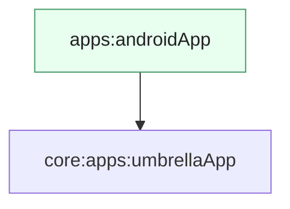

# Módulo `:apps:androidApp`

Este módulo é o **entrypoint Android** do Pokedex: gera o **APK** (ou bundle) e contém apenas o mínimo necessário — `Application`, `MainActivity` e dependência do agregador [`:apps:umbrellaApp`](../umbrellaApp/README.md), onde vivem **Compose**, **Koin completo** e o `App()` partilhado.

---

## Papel na arquitetura

No Android, o fluxo típico é:

1. **`PokedexApplication`** chama `initKoin(this)` no `onCreate` — contexto Android injetado no Koin ([`KoinInit.android.kt`](../umbrellaApp/src/androidMain/kotlin/com/eferraz/pokedex/KoinInit.android.kt) no `:apps:umbrellaApp`).
2. **`MainActivity`** usa `setContent { App() }`, onde `App` vem do umbrella e delega à UI em [`:features:composeApp`](../../presentation/composeApp/README.md).

Toda a lógica de negócio, rede, banco e navegação fica **fora** deste módulo — aqui só há **casca** e manifesto da aplicação.

---

## Organização

| Ficheiro | Função |
|----------|--------|
| `PokedexApplication` | Inicialização global do Koin com `Context`. |
| `MainActivity` | Activity única, edge-to-edge, conteúdo Compose = `App()`. |

---

## Módulos relacionados

---

## Decisões que importam

### Um único `MainActivity`

Compose assume a **navegação** interna; não há várias activities por ecrã — simplifica estado e deep links futuros.

### Koin no `Application`

Inicializar o grafo **uma vez** no processo evita múltiplos `startKoin` e garante `androidContext` disponível para módulos que precisam do contexto Android.

---

## Ligações úteis

| Documento | Conteúdo |
|-----------|----------|
| [`:apps:umbrellaApp`](../umbrellaApp/README.md) | Agregador KMP e `App()`. |
| [`:features:composeApp`](../../presentation/composeApp/README.md) | UI Compose. |
| [`build-logic`](https://github.com/enirsilvaferraz/build-logic) | Plugins e convenções Gradle. |
