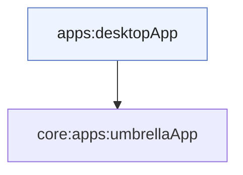

# Módulo `:apps:desktopApp`

Este módulo é o **entrypoint Desktop (JVM)** do Pokedex: aplicação **Compose Multiplatform for Desktop** que depende apenas de [`:apps:umbrellaApp`](../umbrellaApp/README.md) e abre uma **janela** com o mesmo `App()` usado no Android e iOS.

---

## Papel na arquitetura

O `main` em [`main.kt`](src/main/kotlin/com/eferraz/pokedex/main.kt):

1. Chama **`initKoin()`** (sem `Context` — variante JVM em [`KoinInit.jvm.kt`](../umbrellaApp/src/jvmMain/kotlin/com/eferraz/pokedex/KoinInit.jvm.kt)).
2. Inicia o loop **`application { Window { … App() } }`** do Compose Desktop.

Assim, **rede**, **Room (JVM)** e **casos de uso** são os mesmos do resto do projeto; só muda o **host** de janela e distribuição nativa (DMG, MSI, DEB conforme `build.gradle.kts`).

---

## Organização

| Peça | Função |
|------|--------|
| **`MainKt`** | Ponto de entrada declarado em `compose.desktop.application.mainClass`. |
| **Janela** | Título “Pokedex”, fecho termina a aplicação. |

---

## Módulos relacionados

---

## Decisões que importam

### Um processo, uma janela

O desenho atual concentra a experiência numa **única** janela Compose — coerente com o grafo de navegação interno do `:features:composeApp`.

### Pacotes nativos

`nativeDistributions` define **nome**, **versão** e formatos de instalador para distribuir o binário sem repetir lógica de produto.

---

## Ligações úteis

| Documento | Conteúdo |
|-----------|----------|
| [`:apps:umbrellaApp`](../umbrellaApp/README.md) | Koin e `App()`. |
| [`:features:composeApp`](../../presentation/composeApp/README.md) | UI partilhada. |
