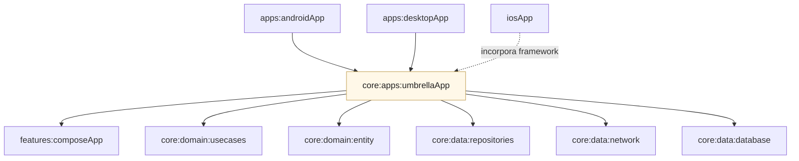

# Módulo `:apps:umbrellaApp`

Este módulo é o **agregador KMP** da aplicação: junta [`:features:composeApp`](../../presentation/composeApp/README.md), [`:domain:entity`](../../domain/entity/README.md), [`:domain:usecases`](../../domain/usecases/README.md), [`:data:repositories`](../../data/repositories/README.md), [`:data:network`](../../data/network/README.md) e [`:data:database`](../../data/database/README.md) num **único artefato** onde o **grafo Koin** fica completo.

Os **entrypoints** nativos — [`:apps:androidApp`](../androidApp/README.md), [`:apps:desktopApp`](../desktopApp/README.md) e o **framework iOS** em [`iosApp`](../../../../iosApp/README.md) — dependem deste módulo para expor `App()` e a inicialização `initKoin` por plataforma.

---

## Papel na arquitetura

Sem o agregador, [`:domain:usecases`](../../domain/usecases/README.md) **não** valida em compile time que todas as implementações existem — daí o `compileSafety` desligado só na camada de casos de uso (ver README de use cases). Aqui, **`MyKoinApp`** declara explicitamente os módulos Koin (`Entity`, `Database`, `Network`, `Repository`, `UseCase`, `Compose`) e o scan do pacote, para o **runtime** resolver interfaces com implementações concretas.

---

## O que este módulo expõe

| Peça | Função |
|------|--------|
| **`App()`** | Composable raiz que delega a `InternalApp` do `:features:composeApp`. |
| **`MyKoinApp`** | Anotação `@KoinApplication` com a lista de módulos do grafo. |
| **`initKoin`** (`expect` / `actual`) | Arranque do Koin no **Android** (com `Context`), **iOS** e **JVM** (desktop). |
| **`MainViewController()`** (iOS) | `ComposeUIViewController` + `initKoin` para incorporar em SwiftUI. |

---

## Módulos relacionados

---

## Decisões que importam

### Um só lugar para o grafo completo

Centralizar módulos Koin **evita** dependências circulares e deixa claro, em build, **quem** pode ver **implementações** de rede e banco.

### Entrypoints finos

Apps Android/Desktop e o host iOS só **inicializam** Koin e mostram `App()` — sem duplicar regras de negócio ou DI.

### Framework iOS com nome estável

Os alvos `iosArm64` / `iosSimulatorArm64` publicam um **framework** consumível pelo Xcode; o SwiftUI chama funções Kotlin exportadas (por exemplo `MainViewController`).

---

## Ligações úteis

| Documento | Conteúdo |
|-----------|----------|
| [`:features:composeApp`](../../presentation/composeApp/README.md) | UI Compose e navegação. |
| [`:data:repositories`](../../data/repositories/README.md) | Orquestração rede + disco. |
| [`:apps:androidApp`](../androidApp/README.md) | APK e `Application` Android. |
| [`:apps:desktopApp`](../desktopApp/README.md) | Janela JVM Compose Desktop. |
| [`iosApp`](../../../iosApp/README.md) | Projeto Xcode e `ContentView`. |
