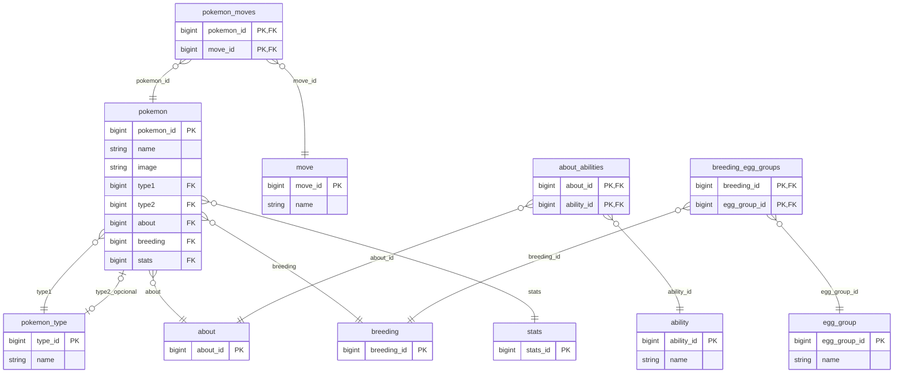
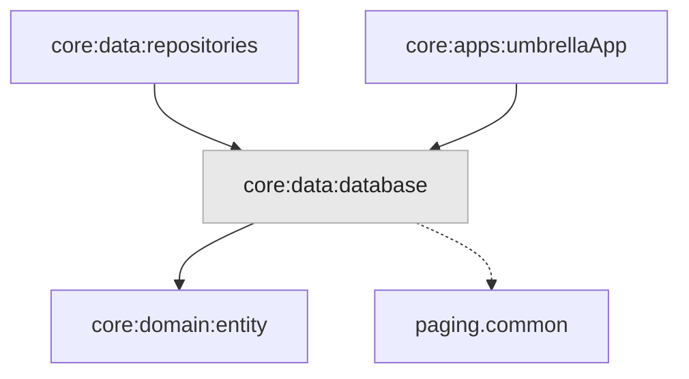

# Módulo `:data:database`

Este módulo é a **persistência local** do app: os dados ficam em **SQLite**, acessados pelo **Room** em **Kotlin Multiplatform** (Android, iOS e Desktop com o mesmo núcleo). Aqui entra tudo o que é **gravar, ler e manter** o estado no disco — **não** entram regras de negócio nem orquestração de fluxos; isso fica em repositórios e casos de uso. O módulo traduz entre o **modelo relacional** (tabelas, chaves, junções) e as entidades de [`:domain:entity`](../../domain/entity).

---

## Papel do Room neste projeto

O Room oferece **consultas verificadas em tempo de compilação**, migrações e um modelo próximo ao SQL, com **uma única base** compartilhada entre plataformas quando se usa o **driver embutido** — o mesmo motor SQLite no pacote, sem depender da versão do sistema. Assim a lista, o cache e o **modo offline** passam a ter uma **fonte de verdade local**: a UI e a rede conversam com repositórios; os repositórios persistem e leem aqui quando faz sentido.

---

## Contrato com o restante do app

Quem consome este módulo **não** precisa conhecer DAOs, nomes de tabelas ou a classe do `Database` do Room. A superfície pública é **mínima** de propósito: só dois pontos de entrada são expostos; o restante do código Room é **interno** e pode evoluir sem quebrar quem só usa o contrato.

| Ponto de entrada | Função |
|------------------|--------|
| **Interface de dados (fonte Pokémon)** | Contrato estável para **inserir** o grafo completo de um Pokémon, **ler** o detalhe agregado e **buscar em lote** por ids (lista, cache, ids vindos da rede). Repositórios devem depender **dela**, não de DAOs nem do objeto de base direto. |
| **Módulo de injeção de dependências** | Registra a base, os acessos aos dados e a implementação da interface acima no grafo global da aplicação. |

Em termos de código, esses tipos são `PokemonDataSourceDatabase` e `DatabaseModule` (Koin); os nomes concretos servem para localizar no projeto.

---

## Organização interna (visão geral)

O código está separado por **papel**, para não misturar definição de esquema, acesso e montagem do banco:

| Área | O que concentra |
|------|-----------------|
| **Núcleo do banco** | Definição da base, construção multiplataforma e migrações. O caminho do arquivo no disco usa `expect` / `actual` por sistema. |
| **Entidades** | Tabelas, chaves e mapeamento para o formato que o Room grava. |
| **Acessos aos dados** | Consultas e inserções; inserções repetidas tratadas de forma segura (ver decisões abaixo). |
| **Relações** | Agregados para leitura (detalhe completo com coleções). |
| **SQL Views** | Leituras **achatadas** para lista e lotes — um resultado simples por linha. |
| **Fonte de dados** | Transações e orquestração que implementam a interface pública. |
| **Injeção** | Registro dos componentes no Koin. |

---

## Diagramas

### Modelo relacional

Visão das **tabelas** e **foreign keys** (setas no sentido **filho → pai**). As FKs usam `ON DELETE/UPDATE CASCADE` onde aplicável.

### Módulos relacionados

---

## Decisões que importam

### Uma base em todos os sistemas

Usamos o **SQLite embutido** no app e a mesma lógica de construção da base em código comum. Só o **caminho do arquivo** muda por plataforma (pastas do Android, documentos no iOS, diretório temporário na JVM), através de `expect` / `actual` — sem duplicar regras de persistência.

### Pouca superfície, muita liberdade por dentro

Tabelas, DAOs e detalhes de esquema são **detalhe de implementação**. Quem está fora do módulo fala em **operações de domínio** (guardar Pokémon completo, ler detalhe, carregar lote por ids) e no módulo Koin que expõe a base. Assim uma refatoração interna **não espalha** pelo resto do monorepo.

### Gravação “tudo ou nada” no detalhe completo

Ao guardar um Pokémon **com todas as peças** (tipos, stats, listas associadas, junções), o trabalho corre dentro de uma **transação**: ou **tudo** entra no disco no mesmo commit, ou **nada** — evita ficar com metade dos dados se algo falhar a meio.

### Lista leve vs. detalhe rico

Para **lista e leituras em lote**, o que interessa é um resultado **simples e direto**: poucas colunas, tipos já resolvidos, sem explosão de linhas. Isso é feito com **SQL Views** que juntam o necessário num único `SELECT`.

Para o **detalhe completo**, o modelo tem **várias coleções** (habilidades, golpes, grupos de ovos, etc.). Forçar isso num único SQL “plano” gera duplicados ou agregação frágil. Aqui o Room monta o **grafo de objetos** com relações entre entidades — alinhado a como os dados estão **normalizados** nas tabelas.

### Inserções que podem repetir-se

Em sincronização ou reprocessamento, o mesmo registro pode ser **pedido de novo**. A estratégia de conflito em inserções privilegia **ignorar duplicados** em vez de substituir à força: a transação **não é derrubada por duplicata**, e dados já gravados **não são sobrescritos** sem intenção — com o trade-off de não usar `REPLACE` cego para tudo.

