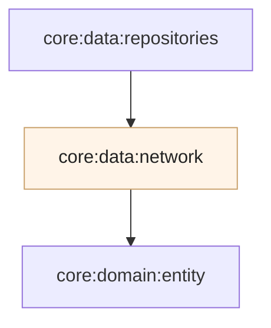

# Módulo `:data:network`

Este módulo é a **fronteira HTTP** do app: tudo o que sai do telefone ou do desktop em direção à **PokéAPI** (e volta como JSON) passa por aqui. Ele **não** define regras de negócio nem decide *quando* chamar a rede — isso fica nos repositórios e casos de uso. A responsabilidade aqui é **falar o protocolo certo**, **serializar e desserializar** bem, e **isolar** o resto do código dos detalhes de URL, cabeçalhos e motor de sockets.

---

## Papel do Ktor neste projeto

**Ktor Client** é o cliente HTTP oficial do ecossistema Kotlin: chamadas **suspensas** (alinhadas a corrotinas), plugins para tempo limite, negociação de conteúdo e logging. Num projeto **multiplataforma**, o mesmo código descreve **como** pedir cada recurso; só o **motor** que efetivamente abre sockets muda por sistema operacional — o que mantém uma única narrativa de rede em `commonMain`.

---

## As três frentes da API (espelho do contrato REST)

A PokéAPI expõe recursos que o app consome em **três grupos** — a mesma lógica descrita no README raiz em **Trade-offs da API**:

| Recurso | Objetivo |
|---------|----------|
| **Listagem** — `GET pokemon` com paginação | Descobrir **quais** Pokémon existem e em que página (resultado enxuto por item). |
| **Detalhe** — `GET pokemon/{id}` | Trazer a **ficha** do Pokémon (stats, tipos, moves, sprites, etc.). |
| **Espécie** — `GET pokemon-species/{id}` | Dados de **espécie** que o detalhe do Pokémon não cobre sozinho (textos, habitat, taxas, ovos, …). |

Uma camada fina (facade de rotas) concentra esses caminhos relativos à **URL base** da API, para não espalhar strings em todo o código.

---

## Do JSON ao domínio

As respostas da API são **DTOs** (modelos próprios da rede) com a forma exata do JSON. **Não** são reutilizados como modelos de tela em todo o app: onde faz sentido, o módulo **mapeia** para as entidades de [`:domain:entity`](../../domain/entity).

Isso faz duas coisas: **desacopla** o contrato REST de mudanças de UI ou de persistência, e **concentra** a tolerância a campos a mais ou a menos no limite da rede (JSON configurado de forma **permissiva** para não quebrar quando a API evoluir levemente).

---

## Um cliente único, reutilizado em toda a app

Há **um** `HttpClient` configurado e registado no grafo de injeção de dependências como **instância única** para a aplicação. Sobre ele:

- **URL base** e cabeçalhos padrão (por exemplo `Content-Type` JSON) para não repetir em cada pedido.
- **Tempo máximo** de espera em pedidos e sockets, para chamadas não ficarem penduradas indefinidamente.
- **Registro de logs** legível em debug (via logger multiplataforma), sem misturar a UI com tráfego de rede.
- **Negociação de conteúdo** para JSON com `kotlinx.serialization`, alinhada aos DTOs.

Assim, listagem, detalhe e espécie **compartilham** política de rede e comportamento — em vez de criar clientes diferentes por tela.

---

## Motores por plataforma (`expect` / `actual`)

O protocolo TCP/TLS e a pilha HTTP nativa mudam entre Android, iOS e JVM. O Ktor escolhe o **engine** certo por alvo:

| Alvo | Engine |
|------|--------|
| Android | OkHttp |
| iOS | Darwin (NSURLSession) |
| JVM / Desktop | CIO |

O arquivo `expect` em código comum declara o motor; cada `actual` fornece a implementação.

---

## Organização interna (visão geral)

| Área | O que concentra |
|------|-----------------|
| **Núcleo do cliente** | Configuração do `HttpClient`, timeouts, logging, JSON e pedido base. |
| **API de rotas** | Facade com os `GET` da listagem, detalhe e espécie. |
| **DTOs** | Estruturas que espelham o JSON da PokéAPI. |
| **Fontes de dados (API)** | Implementações que chamam a facade e devolvem dados para mapeamento ou uso pelos repositórios. |
| **Mapeadores** | Conversão de resposta de rede → entidades de domínio, quando aplicável. |
| **Injeção** | Registro do cliente e dos componentes de rede no Koin. |
| **Plataforma** | `expect` / `actual` do motor HTTP. |

---

## Módulos relacionados

---

## Decisões que importam

### Uma política de rede só

Centralizar **base URL**, **timeouts** e **JSON** num único lugar evita que cada feature invente um cliente diferente — o que é **essencial** quando se quer limitar concorrência, cache e comportamento offline em outras camadas.

### JSON tolerante a evolução

Ignorar chaves desconhecidas e flexibilizar o parser reduz **quebras** quando a API acrescenta campos sem aviso. Os modelos de domínio continuam **estáveis**; só os DTOs absorvem o ruído.

### Rede sem vazar para a UI

Componentes de interface **não** importam `HttpClient` nem DTOs brutos: o fluxo passa por **repositórios** e **domínio**. Este módulo é a **única** camada que sabe que a PokéAPI fala em `pokemon` e `pokemon-species`.

### Log útil para diagnóstico

Em desenvolvimento, os pedidos e respostas podem ser **logados** de forma uniforme; isso ajuda a reproduzir **timeouts** e **erros** sem instrumentar cada tela à mão.

