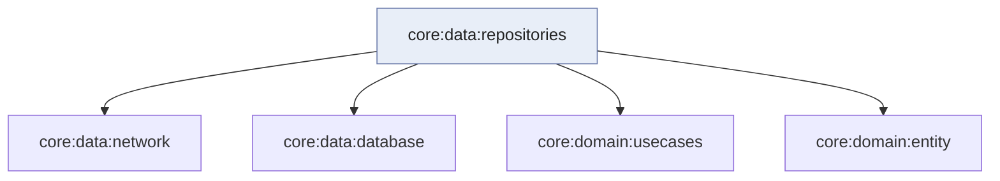

# Módulo `:data:repositories`

Este módulo é a **orquestração da camada de dados**: implementa as **interfaces de repositório** declaradas em [`:domain:usecases`](../usecases/README.md), combinando **fontes HTTP** ([`:data:network`](../network/README.md)) e **persistência** ([`:data:database`](../database/README.md)) para expor um único contrato ao domínio.

Aqui não há regras de apresentação nem Compose — só **como** obter, guardar e sincronizar dados de Pokémon (resumo, detalhe, espécie) de forma coerente com o que a UI e os casos de uso esperam.

---

## Papel na arquitetura

Na **Clean Architecture**, os repositórios ficam na **borda entre domínio e infraestrutura**: o domínio vê **interfaces**; este módulo fornece as **implementações** e decide *cache primeiro ou rede*, *quando* persistir e *como* compor API + Room.

O [`RepositoryModule`](src/commonMain/kotlin/com/eferraz/pokedex/repositories/di/RepositoryModule.kt) **inclui** os módulos Koin de rede e banco, para que as fábricas dos repositórios recebam datasources já registrados.

---

## O que cada implementação faz (visão geral)

| Implementação | Comportamento em alto nível |
|---------------|-----------------------------|
| **Resumo** | Observa o **disco** (com limite/offset alinhado à região Kanto); se a lista local estiver **vazia**, dispara **fetch** na API e grava em lote. |
| **Detalhe** | `get` tenta **banco** primeiro; se não houver, **busca na API** e faz **upsert** transacional do grafo completo. |
| **Espécie** | Hoje a leitura principal vem da **API**; `upsert` no banco permite **enriquecer** ou persistir espécie quando integrado ao fluxo de detalhe. |

Os nomes exatos das classes estão no código-fonte; a ideia é **três frentes** espelhando a API REST e o contrato de domínio.

---

## Organização interna (visão geral)

| Área | O que concentra |
|------|-----------------|
| **Implementações** | Classes `@Factory` que implementam interfaces de [`:domain:usecases`](../usecases/README.md). |
| **Injeção** | `RepositoryModule` com `@ComponentScan` e `includes` de `NetworkModule` + `DatabaseModule`. |

---

## Módulos relacionados

---

## Decisões que importam

### Uma implementação por contrato de domínio

Cada interface de repositório tem uma **classe dedicada**, fácil de testar e substituir — em vez de um “god object” que mistura listagem e detalhe.

### Disco antes da rede quando faz sentido

No **detalhe**, ler primeiro o **Room** reduz latência e suporta **offline** parcial; a rede só entra quando não há dados locais ou quando o caso de uso pede **refresh** explícito.

### Agregação explícita no Koin

Incluir `NetworkModule` e `DatabaseModule` no módulo de repositórios **documenta** o grafo: quem importa repositórios traz, por arrastamento, as dependências de infraestrutura necessárias (no contexto do app agregado).

### Paging e fluxos

A camada de resumo usa **Flow** do disco (e integração com **Paging** onde aplicável) para a UI reagir a mudanças sem acoplar SQLite à Compose.

---

## Ligações úteis

| Documento | Conteúdo |
|-----------|----------|
| [`:domain:usecases`](../usecases/README.md) | Contratos que este módulo implementa. |
| [`:data:network`](../network/README.md) | Cliente HTTP e DTOs. |
| [`:data:database`](../database/README.md) | Room e datasources locais. |
| [`:features:composeApp`](../../presentation/composeApp/README.md) | UI que consome casos de uso. |
| [`:apps:umbrellaApp`](../../apps/umbrellaApp/README.md) | Onde o grafo Koin completo é montado. |
