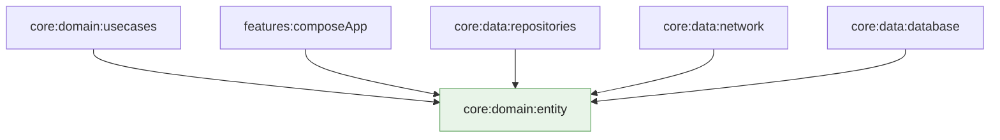

# Módulo `:domain:entity`

Este módulo é o **vocabulário de domínio** do app: tipos estáveis que descrevem Pokémon, tipos elementais, movimentos, espécie, estatísticas e tudo o que a aplicação precisa para **falar de negócio** sem depender de rede, banco ou interface.

**Não** há aqui chamadas HTTP, SQL nem Compose — só **modelos** (e um módulo mínimo de injeção que registra o pacote). Quem precisa de **como** obter ou guardar dados importa **outras camadas**; quem só precisa de **o que é um Pokémon** importa este módulo.

---

## Papel na arquitetura

Na **Clean Architecture**, o domínio fica no centro do gráfico de dependências. `:domain:entity` é a **base**: **nenhum** outro módulo de domínio ou de dados “fica abaixo” dele. Assim, UI, rede e persistência podem mudar sem obrigar a reescrever a definição do que é um resumo ou um detalhe de Pokémon — desde que os contratos em [`:domain:usecases`](../usecases/README.md) continuem coerentes.

---

## O que existe aqui (visão geral)

| Ideia | Descrição |
|-------|-----------|
| **Identidade comum** | Tipos que carregam **id** e **nome** onde faz sentido, para listas e cabeçalhos sem puxar o grafo inteiro. |
| **Resumo** | Modelo **leve** para lista e cartões: o suficiente para mostrar linha e enriquecer depois. |
| **Detalhe** | Modelo **rico** para a ficha completa: stats, movimentos, reprodução, texto de espécie, etc. |
| **Peças reutilizáveis** | Conceitos compartilhados (por exemplo tipo elemental, habilidade, movimento) modelados uma vez e compostos no detalhe. |

Os nomes concretos das classes vivem no código-fonte; a ideia é **compartilhar linguagem** entre listagem, detalhe, rede e base local sem acoplar formatos JSON ou tabelas SQL.

---

## Organização interna (visão geral)

| Área | O que concentra |
|------|-----------------|
| **Raiz do domínio** | Contratos mínimos compartilhados (por exemplo identidade base de um Pokémon). |
| **Resumo** | Entidades pensadas para **lista** e navegação rápida. |
| **Detalhe** | Entidades pensadas para **ficha completa** e subestruturas (stats, espécie, reprodução, …). |
| **Injeção** | Registro Koin por varredura do pacote — sem lógica de negócio. |

---

## Decisões que importam

### Só domínio, sem infraestrutura

Se aparecesse aqui um `HttpClient` ou um `@Entity` do Room, o domínio **dependeria** de detalhes de plataforma. Mantemos **apenas** tipos e contratos de domínio para o grafo de módulos permanecer **invertível**: dados e UI implementam o que o domínio pede, não o contrário.

### API explícita no Kotlin

O módulo é compilado com **API explícita**: visibilidade e tipos públicos são **intencionais**. O que não precisa ser consumido fora do pacote fica restrito — o que reduz superfície acidental e documenta o que é “contrato” de verdade.

### Um módulo, uma responsabilidade

**Entidade** não orquestra fluxos nem decide *quando* sincronizar. Isso mantém o pacote **pequeno**, fácil de reutilizar em testes e em futuros recursos (favoritos, comparação, busca) sem puxar meio projeto para dentro.

---

## Módulos relacionados

