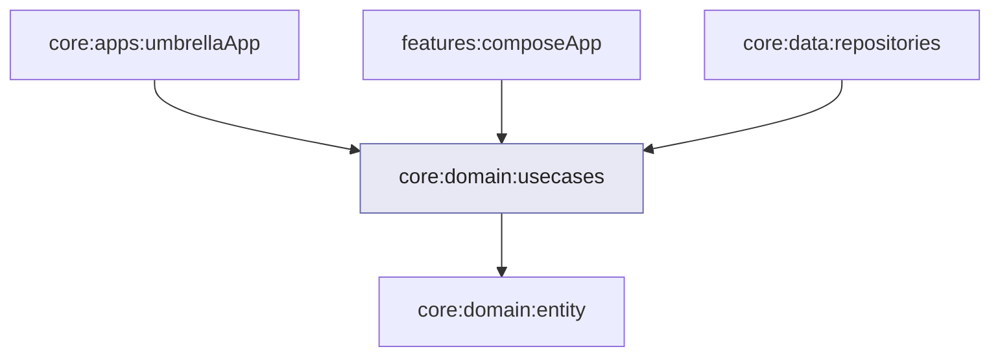

# Módulo `:domain:usecases`

Este módulo é a **camada de casos de uso** e de **contratos de dados**: define **o que a aplicação pode fazer** (observar lista, carregar detalhe, enriquecer resumo) e **como os repositórios se comportam** — **sem** implementar rede, Room ou UI.

As **implementações** dos repositórios ficam em [`:data:repositories`](../../data/repositories/README.md); este módulo declara **só as interfaces**. Esse desenho é o que permite **inverter a dependência**: o domínio manda nas abstrações; a infraestrutura obedece.

---

## Papel na arquitetura

Quem apresenta telas ou quem fala com a PokéAPI **não** importa DAOs nem `HttpClient` diretamente para decidir regras de produto. Os casos de uso **encapsulam** intenção (“carregar detalhe”, “observar lista”, “atualizar tipo quando visível”) e delegam em **contratos** que a camada de dados cumpre. Assim, testes e mudanças de API têm um **único lugar** para concentrar regras.

---

## Contratos de repositório (interfaces)

A camada de dados expõe **implementações** destas interfaces; aqui só existe o **contrato**:

| Contrato | Papel |
|----------|-------|
| **Resumo** | Fornecer fluxo de **lista** (o que mostrar na Pokédex agregada). |
| **Detalhe** | Obter **ficha completa** por identificador, combinando o que vier da rede e do disco. |
| **Espécie** | Obter dados de **espécie** quando necessário para completar o detalhe. |

Os nomes exatos das interfaces estão no código-fonte; a ideia é **três frentes** alinhadas à API REST (listagem, Pokémon, espécie), sem vazar DTOs da rede para a UI.

---

## Casos de uso (visão geral)

| Intenção | Comportamento em alto nível |
|----------|------------------------------|
| **Observar a lista** | Expõe um **fluxo** contínuo de resumos — a UI reage quando o disco ou a rede atualizam dados. |
| **Carregar detalhe** | Dado um identificador, devolve **resultado** com ficha completa ou erro — trabalho pesado fora da thread principal via despacho configurável. |
| **Enriquecer resumo** | Quando a lista precisa de dados que só existem no detalhe, orquestra **uma** atualização controlada por item, com limites de paralelismo (ver abaixo). |

Há uma classe base comum para casos que devolvem **`Result`**, executam em **dispatcher** configurável e podem **medir tempo** de execução para diagnóstico — sem obrigar todos os casos a compartilharem a mesma forma.

---

## Concorrência ao enriquecer dados

A listagem da API **não traz** tudo o que a UI deseja de uma vez; é preciso **complementar** por item. Disparar muitas chamadas ao mesmo tempo **sobrecarrega** rede, CPU e a API pública.

Por isso, o caso de uso de enriquecimento combina:

- **Mutex** — evita processar o **mesmo** identificador em paralelo (por exemplo scroll rápido).
- **Semáforo** — limita **quantas** operações podem correr **ao mesmo tempo**, criando **back-pressure** explícito.

Essas primitivas são fornecidas pelo módulo de injeção de casos de uso (valores fixos no registro), para o caso de uso **não** criar estado global à mão.

---

## Injeção de dependências (Koin) e `compileSafety`

O projeto usa **Koin** com **anotações** e geração de código. Neste módulo, o compilador do Koin **não** valida o grafo completo contra implementações concretas de repositório — porque **aqui não há** dependência Gradle para `:data:repositories`. Só no **módulo agregador** da aplicação é que todas as peças se ligam.

Isso é uma escolha **consciente**: manter o domínio **livre** da camada de dados no grafo de módulos. O custo é validar o grafo **completo** em outro lugar (build do app ou testes de integração), não neste módulo isolado.

---

## Organização interna (visão geral)

| Área | O que concentra |
|------|-----------------|
| **Contratos** | Interfaces de repositório usadas pelos casos de uso. |
| **Casos de uso** | Implementações concretas das intenções da aplicação. |
| **Núcleo** | Classe base comum (`Result`, dispatcher, medição opcional). |
| **Injeção** | Módulo Koin: varredura dos casos de uso + **dispatcher**, **mutex** e **semáforo** compartilhados. |

---

## Módulos relacionados

No grafo Gradle, `:data:repositories` **depende** de `:domain:usecases` (interfaces); os casos de uso **não** dependem da implementação dos repositórios.

---

## Decisões que importam

### Domínio sem Gradle para “dados”

O módulo **não** declara `implementation(project(":data:repositories"))`. Só **runtime** (e o agregador) encaixa interfaces com implementações. Isso **protege** a regra: *use cases não conhecem SQL nem JSON*.

### Resultado explícito

Casos que podem falhar (rede, parse, disco) devolvem **`Result`** em vez de lançar para toda a parte — a UI decide como mostrar erro **sem** capturar exceções espalhadas.

### Um dispatcher para trabalho pesado

Operações que não devem bloquear a interface usam um **dispatcher** injetado (por padrão, pool adequado a trabalho em segundo plano), centralizado no módulo de injeção.

