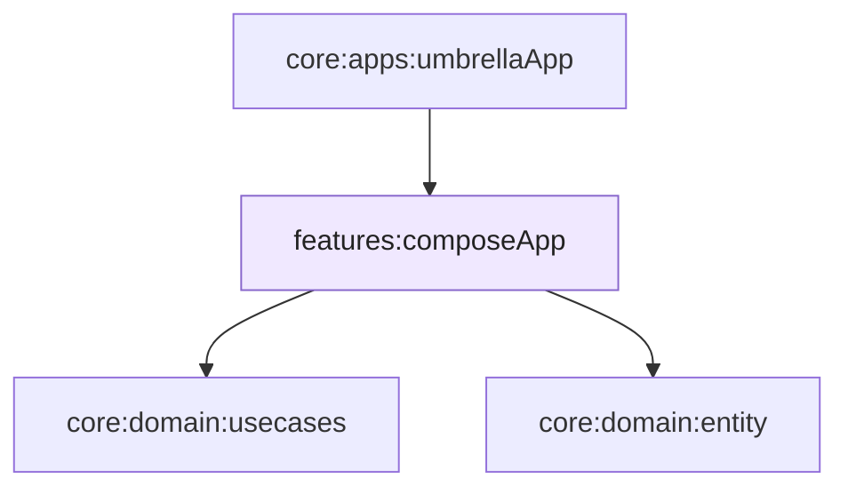

# Módulo `:features:composeApp`

Este módulo concentra a **interface Compose Multiplatform** compartilhada: tema, navegação, ecrãs de **lista** e **detalhe**, **ViewModels** e injeção mínima (`ComposeModule`) que referencia [`:domain:usecases`](../../domain/usecases/README.md).

Não implementa HTTP nem Room — só **consome** casos de uso e entidades de [`:domain:entity`](../../domain/entity/README.md), assumindo que o **binário final** (por exemplo [`:apps:umbrellaApp`](../../apps/umbrellaApp/README.md)) liga implementações de repositório e inicialização do Koin.

---

## Papel na arquitetura

A apresentação **reage** a fluxos e resultados do domínio (lista paginada, detalhe com `Result`, enriquecimento controlado). Componentes reutilizáveis (temas, estados de carregamento/erro) mantêm o **comportamento** alinhado entre Android, iOS e Desktop sem duplicar lógica de negócio.

---

## Navegação

A navegação usa **Navigation Compose** com **rotas tipadas** (`@Serializable` / classes de rota). Os argumentos são **type-safe** da lista até ao detalhe — sem chaves soltas em `String`.

O grafo vive em [`InternalApp`](src/commonMain/kotlin/com/eferraz/pokedex/core/App.kt): destino inicial **lista de Pokémon** e rota de **detalhe** com parâmetros de resumo (id, nome, arte, tipo).

---

## Lista e detalhe (visão geral)

| Área | Responsabilidade |
|------|------------------|
| **Pokedex** | Lista com paging, cartões e navegação para o detalhe. |
| **Detalhe** | Ficha completa, tipos, stats, textos de espécie — orquestrada pelo `PokemonViewModel` e casos de uso. |
| **Componentes** | Cartões, tags de tipo, ecrãs de loading/falha — reutilizáveis e desacoplados de Ktor/Room. |

---

## Bibliotecas que importam para a UI

| Biblioteca | Uso |
|------------|-----|
| **Lifecycle** | `ViewModel`, `runtimeCompose` — ciclo de vida e estado na Compose. |
| **Coil** | Imagens remotas (artwork) com integração Ktor. |
| **Paging** | Lista eficiente alinhada aos fluxos de dados do domínio. |

---

## Formatação e `expect` / `actual`

Helpers de **formatação numérica** e detalhes por plataforma seguem `expect` / `actual` em `commonMain` + fontes por alvo (`androidMain`, `iosMain`, `jvmMain`), para texto e locale corretos sem puxar APIs específicas para o código comum.

---

## Módulos relacionados

---

## Decisões que importam

### ViewModels sem infraestrutura

ViewModels dependem de **casos de uso** e tipos de domínio — não de `HttpClient` ou DAOs — para manter testes e mudanças de API **localizadas** nas camadas de dados.

### Um `ComposeModule` enxuto

O módulo Koin da feature **inclui** `UseCaseModule` e faz scan dos ViewModels; a **amarração** com repositórios concretos fica no agregador da aplicação.

### UI resiliente

Estados de **carregamento** e **falha** são tratados de forma explícita (templates dedicados), alinhado ao uso de `Result` no domínio.

---

## Ligações úteis

| Documento | Conteúdo |
|-----------|----------|
| [`:domain:usecases`](../../domain/usecases/README.md) | Casos de uso e contratos de repositório. |
| [`:domain:entity`](../../domain/entity/README.md) | Modelos de domínio exibidos na UI. |
| [`:data:repositories`](../../data/repositories/README.md) | Implementações usadas em runtime pelo app agregado. |
| [`:apps:umbrellaApp`](../../apps/umbrellaApp/README.md) | Grafo Koin completo e `App()` raiz. |
