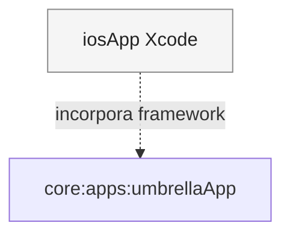

# Pasta `iosApp` (Xcode)

Este diretório contém o **projeto Xcode** que empacota o **framework Kotlin** gerado pelo módulo [`:apps:umbrellaApp`](../core/apps/umbrellaApp/README.md) e apresenta a UI **Compose** dentro de uma hierarquia **SwiftUI**.

Não há lógica de negócio em Swift — só **host** nativo: ciclo de vida iOS, `Info.plist`, ícones e a ponte para o `UIViewController` exposto pelo Kotlin.

---

## Papel na arquitetura

1. O alvo Kotlin **iOS** (arm64 / simulator) compila o umbrella num **framework** (nome alinhado ao projeto KMP).
2. **`MainViewController()`** ([`MainViewController.kt`](../core/apps/umbrellaApp/src/iosMain/kotlin/com/eferraz/pokedex/MainViewController.kt)) chama `initKoin()` e devolve um `ComposeUIViewController` com `App()`.
3. **`ComposeView`** em [`ContentView.swift`](iosApp/ContentView.swift) usa `UIViewControllerRepresentable` para incorporar esse controller em SwiftUI.

O utilizador vê a **mesma** Pokédex que no Android e Desktop; apenas a **camada de embalagem** é Apple.

---

## Organização (visão geral)

| Área | Conteúdo |
|------|----------|
| **`iosApp/`** | SwiftUI, `iOSApp`, assets e preview. |
| **`Configuration/`** | `Config.xcconfig` e ajustes de build. |
| **`*.xcodeproj`** | Esquema e referência ao framework gerado pelo Gradle (conforme a tua integração KMP ↔ Xcode). |

---

## Módulos relacionados

---

## Decisões que importam

### SwiftUI como casca

Manter **mínimo** de Swift facilita evolução: mudanças de produto continuam em **Kotlin** (`commonMain` / `iosMain` do KMP).

### Safe area e teclado

O `ContentView` pode ignorar safe areas conforme necessário para o Compose ocupar o ecrã de forma consistente com outros alvos.

---

## Ligações úteis

| Documento | Conteúdo |
|-----------|----------|
| [`:apps:umbrellaApp`](../core/apps/umbrellaApp/README.md) | `MainViewController`, `initKoin`, `App()`. |
| [`:features:composeApp`](../core/presentation/composeApp/README.md) | Navegação e ecrãs. |
| [README raiz](../README.md) | Visão geral do monorepo e como gerar/abrir o projeto. |
